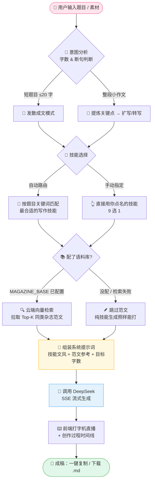

# ✨ 智能仿写平台 | 我把《读者》《意林》的老编辑，装进了一个网页里 🫙

> 家人们谁懂啊！！输入一个题目，30 秒开始蹦字，
> 一篇带故事、带金句、带哲思的《读者》风文章就这么丝滑地流出来了 😭
> 是的，**流出来的**——全程流式打字机效果，看它写作比看它写完还爽。

🏷️ `#AI写作` `#DeepSeek` `#公众号搬砖救星` `#读者意林文学` `#一键成稿`

---

## 🤔 这是个啥？一句话讲完

一个**本地 Web 小站**：你丢一个题目（或一坨素材）进去，它自己做意图分析 → 挑写作技能 → 去云端语料库偷师真·杂志范文 → 组装提示词 → 喊 DeepSeek 开写 → 全程直播创作过程。

出稿风格：正儿八经的《读者》《意林》味儿，不是那种一眼 AI 的塑料文。

## 💅 它凭什么值得你 Star

- 🧠 **9 位「写手」随便换** —— 人物故事 / 情感观点 / 抒情散文 / 素材改写 / 微故事 / 叙事散文 / 哲理散文 / 褒中贬美 / 金句扩写。懒得选？默认「自动路由」，它自己看题下菜。
- 🔮 **输入啥都行** —— 短题目（≤20字）给你发散成文；整段小作文给你提炼关键点再扩写/转写。它自己判断，拿不准你再手动指定。
- 📚 **有真范文打底** —— 可选接一个 Cloudflare 云端语料库（2 万+ 杂志切片向量），生成前先检索同类范文喂给模型，文风瞬间落地。
- 🎬 **创作过程全程直播** —— 意图分析、选技能、检索范文、组装提示词、调用模型，一步一个时间线，工作量看得见。
- 🔐 **Key 只住你浏览器** —— DeepSeek API Key 存 `localStorage`，服务端过手即焚，A 和 B 打开同一网站也是各填各的，互相看不见。
- 🧼 **单页极简 UI** —— 左边配置右边出稿，长文框内滚动不跳页；说明全塞进 ⓘ 悬浮提示，Key 和代理收进「⚙ 设置」，页面干净得像刚整理完的桌面。
- 📋 **一键复制 / 下载 .md** —— 写完直接搬走，公众号后台见。

## 🗺️ 业务流程图（它到底在后台忙什么）



再来一张全家福，看看这套东西的**部署架构**长啥样：

```mermaid
flowchart LR
    subgraph 你的浏览器 🖥️
        UI[单页前端<br/>localStorage 存 Key]
    end
    subgraph 你的服务器 🐳 Docker
        BE[FastAPI backend.py<br/>+ 9 个写作技能快照]
    end
    subgraph Cloudflare ☁️ 可选
        W[Worker: magazine-api]
        V[(Vectorize<br/>2万+ 范文向量)]
        KV[(KV<br/>范文全文)]
    end
    DS[🐋 DeepSeek API]

    UI -- SSE 流式 --> BE
    BE -- 检索范文 --> W
    W --> V
    W --> KV
    BE -- 带着范文喊它开写 --> DS
```

## 🚀 三分钟上手（本地版）

```bash
pip install -r requirements.txt
python backend.py            # 监听 http://127.0.0.1:8000
```

浏览器打开 `http://127.0.0.1:8000` → 填题目 → 填 DeepSeek Key →点「生成」→ 起飞 🛫
（技能目录默认读 `~/.workbuddy/skills`，可用环境变量 `SKILLS_ROOT` 覆盖。）

## 🐳 Docker 部署（Ubuntu 服务器党看这里）

```bash
docker build -t magazine-writer .
docker run -d --name magazine-writer -p 8000:8000 --restart unless-stopped magazine-writer
# 或者一把梭：
docker compose up -d
```

访问 `http://<服务器IP>:8000` 就完事了。

- 镜像已内置 `skills/` 写作技能快照；想用服务器上的最新技能，在 `docker-compose.yml` 挂载 `~/.workbuddy/skills:/app/skills:ro` 覆盖。
- 语料库挂了也不慌，范文只是 buff，不影响出稿。

## ☁️ 进阶玩法：接上你自己的云端语料库（强烈种草）

生成时先检索真·杂志范文喂给模型，文风直接从「像」进化到「是」。语料库跑在 Cloudflare Worker 上（免费额度就够用）。**出于隐私，本仓库不含作者的接口地址**——你要用自己的 Cloudflare 账号部署一套，白嫖一个属于自己的地址 😎

1. 跟着 [`magazine-api/DEPLOY.md`](magazine-api/DEPLOY.md) 走：建 Vectorize / KV → 灌数据 → `wrangler deploy`。
2. 部署成功后 Cloudflare 送你一个专属地址：`https://magazine-api.<你的子域名>.workers.dev`（控制台 **Workers & Pages → magazine-api → 触发器/域名** 也能看）。
3. 把地址喂给客户端：

   ```bash
   docker run -d -p 28080:8000 --restart unless-stopped \
     -e MAGAZINE_BASE=https://magazine-api.<你的子域名>.workers.dev \
     intelligent-imitation-platform:latest
   ```

- `MAGAZINE_BASE` 留空 = 跳过范文检索，纯技能生成，完全正常。
- 网络直连不了 workers.dev？加 `-e MAGAZINE_PROXY=http://...`，或在页面「⚙ 设置 → 代理地址」里临时填。

## 📁 目录结构（收藏前先看看家底）

```
backend.py                FastAPI 服务（页面 + /api/skills + /api/generate 流式接口）
static/index.html         单页前端
skills/                   打包进镜像的写作技能快照（9 位写手的灵魂）
requirements.txt          依赖
Dockerfile                镜像构建
docker-compose.yml        一键编排
magazine-api/             语料库后端部署资产（Cloudflare Worker）
  DEPLOY.md               从零部署自己的语料库接口的保姆级指南
  worker/magazine-worker.js        Worker 源码
  worker/wrangler.toml.example     Worker 配置模板
  scripts/push_to_cf_vectorize.py  灌向量到 Vectorize
  scripts/push_to_cf_kv.py         灌全文到 KV
```

## 🔒 隐私碎碎念（很重要，认真脸）

- DeepSeek API Key **只存在你自己的浏览器里**，服务端不落盘、不记日志、用完即弃；多用户共用一个站点也互不可见。
- 仓库里没有作者的 Cloudflare 接口地址和任何凭据，语料库接口需各自部署、各自持有。

---

> 觉得好用的话给个 ⭐ 吧，你的 Star 是我熬夜掉头发的唯一动力 🥹
> 有想法欢迎提 Issue，评论区……啊不，Issue 区见！👋
